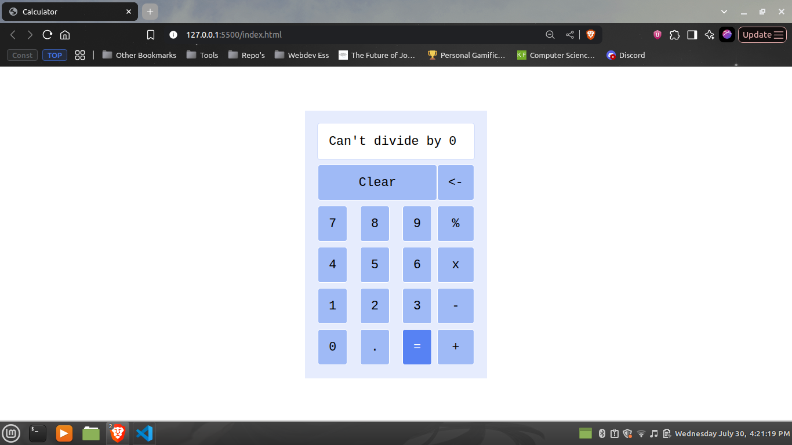

# 🧮 Calculator

A simple web-based calculator built using **HTML**, **CSS**, and **JavaScript**. This project supports basic arithmetic operations and updates the display dynamically as users interact with the interface.

---

## 🚀 Live Demo

🔗 [Live Web Page](https://faizulmd13.github.io/calculator/)

---

## 🔧 Features

- Basic arithmetic operations: addition, subtraction, multiplication, division
- Clear and backspace functionality
- Decimal point support
- Responsive button styling and layout
- Error handling for divide-by-zero

---

## 🛠️ Technologies Used

- HTML5
- CSS3 (Flexbox, CSS Variables)
- Vanilla JavaScript (DOM Manipulation, Event Handling)

---

## 📁 Project Structure

calculator/
│
├── assets/
│ └── demo.png # Screenshot of the calculator UI
├── index.html
├── script.js
├── style.css
└── README.md

---

## 📸 Screenshots

> 

---

## 🖱️ How to Use

1. Open the app in a browser.
2. Click on the number and operator buttons to build your expression.
3. Press `=` to calculate the result.
4. Use `Clear` to reset, or `<-` to remove the last character.

---

## 📄 License

This project is open source and available under the [MIT License](LICENSE).  
(Add a LICENSE file if you want this part to apply)

---

## 👤 Author

Created by [Faizulmd13](https://github.com/Faizulmd13)
